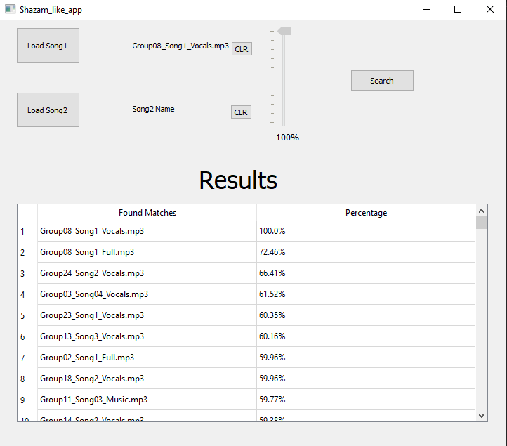
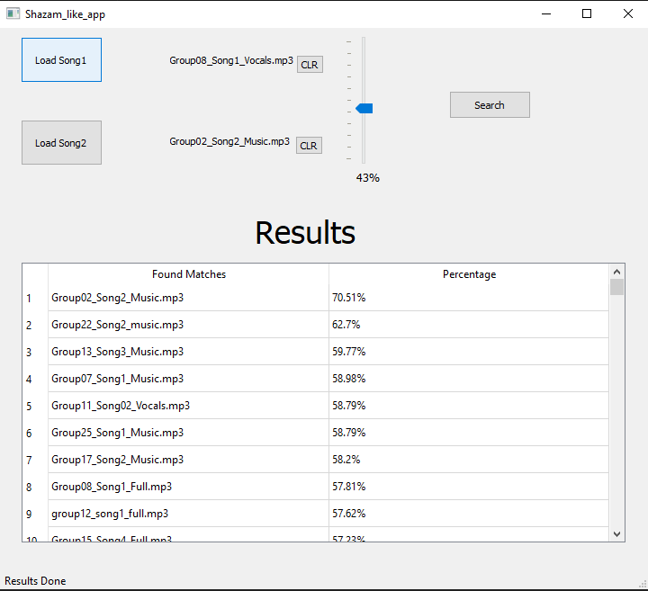

# Fingerprint-Shazam-like-app-

Fingerprinting is basically to identify a signal based on a short sample for it which usually has its intrinsic features and thus these intrinsic features can be used to identify the different varieties or flavors of the signal. Several applications can be directly spotted for such technique. For example: Music industry: Identify a song, a singer voice, a tune. Medical diagnosis: identify arrhythmia types in ECG signals.

The application focuses on Identify a song, a singer voice and a tune.

# Usage
## the application has two modes:
- upload a single .mp3 file to identify it and get similarty precentages with the files in database

- upload two .mp3 files to make a resultant file weighted from the two file and identify it to get similarty precentages with the files in database

